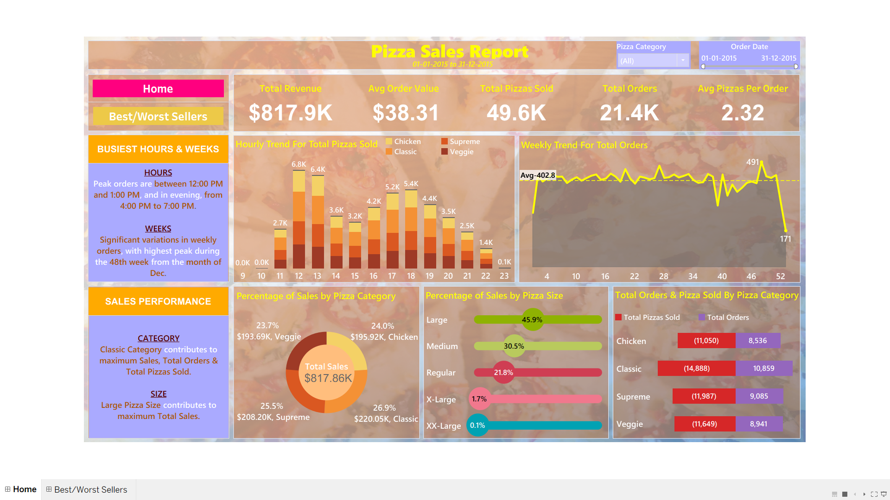
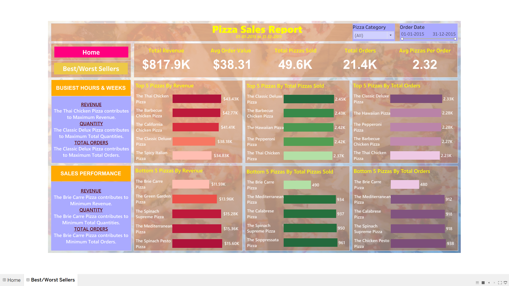

# 🍕 Pizza Sales Analysis (SQL + Tableau)

## 📊 Project Overview
This project analyzes pizza sales data to uncover key business insights such as revenue trends, customer ordering behavior, and product performance.

The project combines **SQL for data analysis** and **Tableau for interactive dashboard visualization**.

---

## 🔗 Tableau Dashboard

👉 **View Interactive Dashboard (Tableau Public):**  
(Check link inside `dashboard/tableau_dashboard_link.txt`)

---

## 📥 Download Tableau Dashboard File

👉 You can download and open the dashboard in **Tableau Desktop**:  
`dashboard/Pizza Sales Dashboard.twbx`

---

## 🛠️ Tools & Technologies
- SQL (SQL Server)
- Tableau Public / Tableau Desktop
- Excel (Data Preparation)

---

## 📌 Key KPIs
- Total Revenue: **$817.9K**
- Average Order Value: **$38.31**
- Total Pizzas Sold: **49.6K**
- Total Orders: **21.4K**
- Avg Pizzas per Order: **2.32**

---

## 🔍 SQL Analysis
The SQL file includes:
- KPI calculations (Revenue, Orders, Quantity)
- Hourly & Weekly trends
- Sales breakdown by category & size
- Top & Bottom performing pizzas

👉 See: `pizza_sales_queries.sql`

---

## 📈 Key Insights
- Peak ordering hours: **12 PM – 1 PM** and **4 PM – 7 PM**
- **Classic pizzas** contribute the highest sales
- **Large size pizzas** generate maximum revenue
- **Classic Deluxe Pizza** is the top-performing item

---

## 📷 Dashboard Preview

### 🏠 Home Dashboard

### 📊 Best/Worst Sellers

---

## 🧩 Project Workflow
1. Data Cleaning (Excel)
2. SQL Analysis (KPIs & Trends)
3. Data Visualization (Tableau)
4. Validation of dashboard insights using SQL

---

## 📁 Dataset Disclaimer
This dataset is publicly available from Maven Analytics and is used for educational purposes only.

---

## 👨‍💻 Author
Shruti
